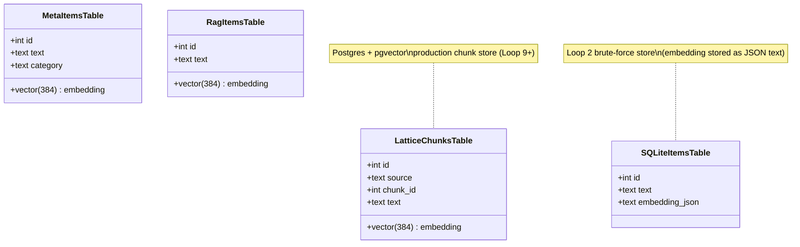
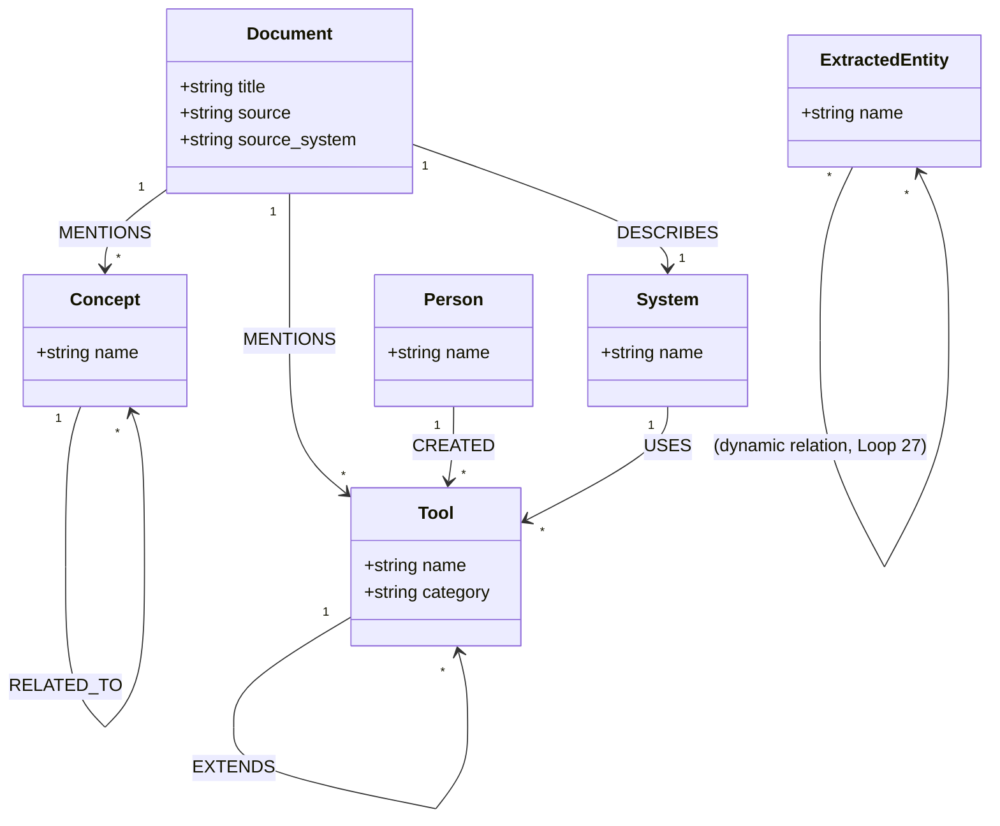
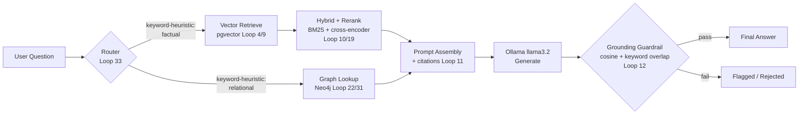
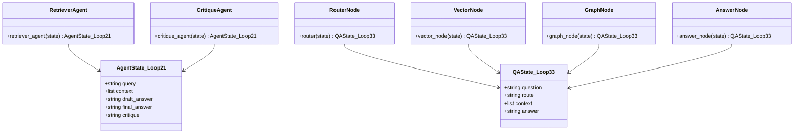
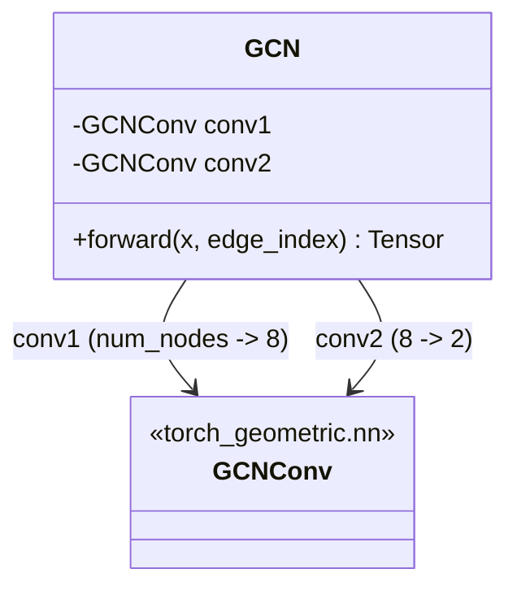

# Lattice — Architecture

System built incrementally across 34 loops (0-33). Not a single deployed app — a sequence of standalone scripts in `src/`, each proving one capability, later loops composing earlier ones. This doc gives class/component diagrams for the pieces that have real structure (Postgres schema, Neo4j schema, the LangGraph agent state machines, the GNN model).

## 1. Storage layer — class diagram

## 2. Neo4j graph schema — class diagram

## 3. RAG retrieval pipeline — component/flow diagram

## 4. Multi-agent state machines (LangGraph) — class diagram

## 5. GNN model — class diagram (Loop 30)

## Data stores in use

| Store | Purpose | Loops |
|---|---|---|
| SQLite (`data/vectors.db`) | brute-force baseline vector search | 2 |
| FAISS (in-memory index) | fast ANN baseline | 3 |
| Postgres + pgvector (Docker `lattice-pg`, port 5432) | production vector store | 4, 6, 9-21, 23, 26, 31, 33 |
| Neo4j (Docker `lattice-neo4j`, ports 7474/7687) | knowledge graph | 22, 25-33 |
| Ollama (localhost:11434, model `llama3.2`) | local LLM for generation, extraction, agents | 5, 11-14, 19-21, 23, 24, 27, 31-33 |

## Known architectural limitations (see also ISSUES.md, SECURITY_NOTICE.md)

- Router (Loop 33) and hallucination guardrail (Loop 12) both use lightweight heuristics (keyword match / keyword-overlap+cosine) rather than a dedicated classifier — good enough for a demo corpus, not tuned for production scale.
- NL-to-Cypher (Loop 32) is unconstrained free-generation with a 3B model; accuracy is not production-grade — see Loop 32 doc.
- No auth/access-control layer anywhere — this is a local, single-user research build, not a deployed service.
